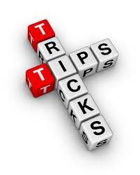
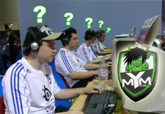

# Comment devenir un pro à Dota : Améliorer son jeu #
## par iGk.Jakku et NinjaMovesPro ## 

_Nom du guide original : [How to be a Pro at Dota : Taking your Game to Higher Level](http://www.playdota.com/guides/how-to-be-a-pro-at-dota)_

_Traduction française : [ChickEnSkill](http://www.twitter.com/ChikenSkill)_

_Github repo : [beProGuide](http://www.github.com/ChickenCoding/tradbeProGuide)_

_License : copyright [playdota.com](http://www.playdota.com), All rights reserved_ 

## Table des matières ##

  1. [Introdution](#c1)
  2. [Pratiquer et être confiant](#c2)
  3. [Posséder ces 5 qualités](#c3)
  4. [Utiliser ces 5 astuces](#c4)
  5. [7 habitudes à prendre](#c5)
  6. [Penser sereinement](#c6)
  7. [Penser comme un Pro](#c7)
  8. [Regarder des Anime](#c8)

<blockquote>
"Employez votre temps à vous améliorer grâce aux écrits d'autres hommes,
afin de gagner facilement ce que d'autres ont labourés difficilement"
<small>Socrate</small>
</blockquote>

 

## Chapitre 1. Introduction ##

Si vous en avez marre de n'être qu'un joueur ordinaire, lisez ce guide basé
sur des années d'analyses de ce que font les bons joueurs et marchant pour nous.
Je ne prétends pas vous transformer en joueur compétitif d'un coup de baguette magique mais
je vous assure une amélioration considérable si vous suivez ces étapes simples.

 

## Chapitre 2. Pratiquer et être confiant 

N'avez vous jamais passé du temps seul, à regarder des replays, à penser à des stratégies, ou
 vous entraîner au last hit?
Voulez-vous échapper à l'ennui et à la fatigue en faisant ces choses? Si oui, vous n'êtes pas seul.
La plupart des joueurs préfère jouer plutôt que pratiquer.
La raison principale à cela est le manque de discipline.

### 2.1 Pratiquez comme si vous êtiez le plus mauvais des joueurs ! ###

Un des facteurs importants de la pratique est l'humilité.
Notre fierté n'arrête pas de nous dire : " pourquoi m'embêterai-je à pratiquer quand, en fait, ce n'est qu'un simple jeu?"
Après une défaite, nous ne pouvons accepter celle-ci car nous somme trop fiers.
Nous devons pratiquer peu importe le domaine.

Si nous pratiquons alors que nous pensons déjà être le meilleur, nous ne sommes pas curieux de découvrir de nouvelles tactiques.
Nous serons limités à notre vieux style de jeu et je parie que ces styles de jeu que nous avons maintenant ont encore matière 
à amélioration.

Pratiquer comme si vous étiez le plus mauvais des joueurs, vous donnera la sensation que vous avez besoin d'apprendre chaque petite
leçon que vous pouvez apprendre d'un replay ou de vos exercices.
Cela ne vous rendra pas fatigué car vous deviendrez intérréssé dans ce que vous faîtes.

### 2.2 Exécutez comme si vous le meilleur ! ###

Dans la partie, vous devriez être confiant. Vous ne pouvez vous permettre d'avoir peur ou d'avoir des pensées négatives.
De vos précédents entraînements, vous avez beaucoup appris et vous êtes maintenant confiant dans vos armes secrètes.

Kobe Bryant, même s'il est ocnsidéré comme une superstar, s'entraîne beaucoup. Certains disent qu'il se "torture lui-même". 
Puis, quand il joue, vous pouvez voir combien confiant il est et les gens le considèrent très sûr de lui.

_Quand vous pratiquez, soyez très pointilleux. Observez et analysez tout. Essayez d'acquérir autant de stratégies et de niveau
de jeu que vous pouvez. Quand vous jouez, Soyez confiant car vous êtes maintenant équipé de nouvelles armes provenant de vos humbles
entraînements qui vous avantage sur votre adversaire_
 

## Chapitre 3. Posséder ces 5 qualités ##

_Vous êtes-vous deja demandé quels sont les plus-values des joueurs top niveau sur vous? 
Ce n'est pas seulement l'expérience et le travail dur. Vous pouvez jouer pendant 10 ans et
ne pas être aussi bon qu'eux si vous ne vous focalisez pas sur les bonnes habiletés à developper.
Voici les choses à considérer si vous voulez jouer comme les Pros._

### 3.1 Calculs mentaux rapides ###

Cette aptitude est très importante pour 3 choses : 

  + Coût de Mana

  + Estimer les dégâts sortants

  + Estimer les temps de rechargement

Etre rapide en calcul vous donne beaucoup d'avantages et de sûreté. Savoir si votre réserve de mana
sera assez grande pour éxécuter cette combinaison vous évitera des problèmes du genre : "Merde! Je suis 
à cours de Mana !", puis mourrir.
Assurez-vous d'être rapide dans vos calculs car un seul moment d'égarement peut causer la perte de la 
bataille.  
Les dégâts sortants devrait aussi être considéré afin de savoir à quelle rapidité vous pouvez tuer un héro
ou si c'est possible de tuer un héro avec vos nombres.
Vous ne devriez pas entrer dans la bataille sans avoir le jeu du combat en tête. 
Les temps de rechargement sont aussi important spécialement si vos adversaires ont des sorts ultimes meurtriers.
Utilisez le temps de rechargement long à votre avantage. Vous pouvez ou bien engager un combat ou push si 
leurs sorts ne sont pas disponibles. Faire plus de calculs que vos opposants vous donnera un énorme avantage.

### 3.2 Main rapide ###

Cette aptitude est très importante pour 3 choses :

  + L'annulation de l'animation

  + Faire des combinaisons et les micros

  + Cliquer des héros qui sont durs à cliquer

L'annulation de l'animation est très importante dans DotA. Beaucoup de héros possèdent des sorts qui ont des animations
prolongées. Vous devriez les annuler pour ne pas perdre de temps. L'annulation de l'animation est une chose très importante
dans l'harrass du héro. Vous pouvez ou avancer ou reculer au lieu d'attendre l'arrêt de l'animation. 
Grâce à cela, vous pouvez plus harrass ou éviter plus de dégâts.
Les combinaisons requièrent de la synchronisation et ne devraient pas être interrompues par des doigts lents.
La micro est le terme utilisée pour définir plus d'unités ce qui demande aussi une main rapide.
Vous pouvez chercher pour un petit icône de héro plus rapidement pour être capable de l'attaquer et ainsi ne pas le 
laisser s'échapper juste parcequ'il n'était pas cliquable.

### 3.3 Faire rapidement des plans ###

Faire des plans est essentiel dans Dota comme cela peut l'être en guerre.
Dès que le choix des héros commence jusqu'à ce que le jeu ne se finisse, plusieurs plans devraient être éxécutés.
L'équipe qui possède les plans meilleurs et plus rapides gangeront à coup sûr.

Les 4 étapes d'un plan réfléchi : 

  1. Ce que vous allez faire

  2. Comment votre adversaire va réagir

  3. Que va être cette réponse à leurs réactions

  4. Savoir qui aura l'avantage après

### 3.4 Vue rapide ###

Cette aptitude est très importante pour 5 choses : 

  + Conscience de la map

  + Trouver la cible

  + Distance par rapport à vos équipiers

  + Nombre d'adversaires

  + Sorts utilisés

La conscience de la map est quelquechose de très important. Vous ne devriez pas être enclin aux ganks, vous 
devriez savoir si vos coéquipiers ont besoin de vous, vous devriez savoir quand les opposants peuvent être tués ou
devraient être esquivés. Trouver votre cible dans un combat est important. Vous ne devriez pas utiliser tous vos sorts sur 
le premier héro venu. Les joueurs pros s'attendent au soutien des autres héros. Réservez vos sorts pour de meilleurs ultilités.
La distance par rapport à vos coéquipiers doit être prise en compte.

### 3.5 Réaction rapide ###

Cette aptitude est très importante pour 5 choses : 
  
  + Habileté à s'échapper 
  
  + Connaître les chemins d'évasion

  + Choisir les cibles

  + Savoir quand combattre et quand ne pas combattre

  + Contrer les attaques

Dota est un jeu d'action/réaction. Vous voyez la situation, puis vous agissez. 
Gagner ou perdre dépend grandement de combien de bonnes ou mauvaises décisions sont faites. Savoir d'une seul coup d'oeil quelles sont les 
meilleures réactions et les éxécuter parfaitement fera de vous un joueur de bon niveau effroyable.

 

## Chapitre 4. Utiliser ces 5 astuces ##

### 4.1 Regarder des replays de pro et imaginer que vous êtes l'un d'eux ###

C'est une astuce qui vous permettre de vous améliorer rapidement. Au lieu d'avoir une pensée 
telle que "Wow, qu'est-ce qu'il est bon !", pensez de cette façon : " Je suis le Shadow Fiend que je regarde. Je farm et j'harrass en même temps.
Il y a peut-être un gank pas loin, je ferais mieux de me cacher." etc.

Le but est qu'il vous faut sentir que vous êtes le joueur qui joue ce héro car c'est le moyen le plus rapide que vous ayez de jouer comme lui.
Cela peut-être Yaphets, Yamateh, 2009 ou d'autres grands joueurs de Shadow Fiend mais vous devriez être ce joueur dans votre imagination lorsque
vous regardez le replay.

J'ai fais cela beaucoup de fois et de part mon expérience, après avoir regarder des replays de bons supports ou gankers comme 820, NS et mon 
préféré Vigoss, ma décision dans cet aspect du jeu (supporting) s'est beaucoup amélioré.
Ce qui arrive est que leurs expériences de jeu deviennentt mienne. Lorsqu'ils échouent, je saurais quoi faire la prochaine fois. Lorsqu'ils réussissent,
je réussis aussi donc je sais que ça marche. 
Je n'ai pas à jouer contre des équipes connues car je l'ai déjà fais grâce à cette technique.

### 4.2 Faire de la vision de vos replays une passion ###

Ne dîtes pas seulement "Ouais! J'ai gagné je m'en vais" ou "Mince! J'ai perdu". Vos victoires ou défaites devraient tout le temps être régardées.
Si vous cherchez la perfection dans votre jeu vous ne devriez pas avoir la feignantise de vérifier les erreurs que vous avez faites et qui ont 
besoin d'être corrigée. Cela peut passer par une simple erreur de lasthit ou par un gros problème qui a causé la défaite à votre équipe, vous devriez
être au courant des choses que vous ne faites pas bien pour être capable de les corriger.

Dans les parties d'équipe, c'est un point très critique de regarder vos replays. A chaque partie ou presque, il y a un échec d'éxecution de combo.
Quelquefois vous allez juste gagner car l'équipe adverse n'est pas encore assez expérimenté mais vous avez encore quelqu'un qui meurt. Oui ce n'est pas
si facile de faire un balayage d'équipe 5-0 si vous jouez contre de bonnes équipes mais il y a un toujours un moyen.
Il y a peut-être un besoin de configurer votre stratégie ou line-up.

J'étais trop fainéant pour regarder mes replays avant mais quand j'ai commencé, j'ai découvert 1000 tonnes d'erreurs que je faisais. Ce n'est qu'alors
que je les corrigeai. Après avoir fait de la vision de mes replays une passion, je fût ébahi de mes propres améliorations. 
Si seulement j'avais ouvert les yeux et fait des sessions d'examen de mes propres vidéos, j'aurais pu m'améliorer 2 ans auparavant mais je ne regrette rien 
de mes expériences. 
J'ai appris de celles-ci.

### 4.3 Avoir assez de temps libre pour masteriser le héro désiré ###

Ne vous-êtes pas déjà demandé pourquoi votre jeu n'est pas aussi bon que le jeu des autres héros.
Améliorer votre jeu provient également de comment utiliser votre héro. C'est pourquoi autant de guides sont répandus sur le net. 

Jouer un héro pendant 2 ou 3 jours vous permettra d'être comfortable avec le héro que vous désirez masteriser; vous expérimenterez plusieurs 
actions qui pourront arriver dans de vraies parties, vous y serez préparés, et vous connaîtrez différentes stratégies qui vous assureront la réussite
dans l'utilisation de ce héro.

J'ai joué Chen pas pendant 3 jours mais 3 mois. Ceci parce que j'étais un débutant à ce moment-là (ma première année de DotA) et j'étais habitué à jouer carry.
Je découvris que Chen était le héro le plus joué par les équipes pros à ce moment-là. Je ne voulais pas demander cet pratique ennuyante à aucun de mes 
coéquipiers donc j'ai changé de rôle pour support et pratiqué Chen pendant des mois. 
Dès lors qu'ils voyaient Chen, ils pensaient immédiatement à moi. Les bon joueurs de Chen se moquaient de mon micro-management des creeps.
Après 3 mois de pratique, mon équipe évolua de débutante à équipe redoutée en tournoi. Chen m'a donné beaucoup de récompenses en championnat. Vous n'avez pas besoin de 
3 mois car je devine que vous avez déjà plus d'expérience que moi dans le jeu compétitif que je n'en avais à l'époque.

### 4.4 Toujours jouer contre de meilleurs joueurs ###

Vous allez perdre. Et alors? si vous n'êtes pas assez fort pour gérer les critiques, vous êtes trop faible pour être glorifié. Jouer contre de meilleurs joueurs vous 
fera réaliser vos failles et les choses qui doivent être ajustées dans votre jeu. Vous serez aussi tenté de surpasser son niveau de jeu, si vous êtes assez optimiste
(et vous avez besoin de l'être).

Nous avons tous déjà perdu. J'ai même offert des parties gratuites pour que de bonnes équipes jouent contre nous. J'ai perdu de l'argent et j'en perd encore 
mais je les ai toujours invitées à jouer contre nous. 
Les émotions ne sont pas joyeuses quand nous perdons mais ce qui arrive est que nous nous améliorons. Nous regardions les replays de parties jouées contre eux. 
Nous avons découvert leurs stratégies et nous en avons créer de meilleurs. 
Le temps vînt où personne ne pût nous battre ici dans notre ville même l'équipe que nous avions payés pour jouer.
C'est comme un business. Investissement et travail dur d'abord, puis la réussite suivra.

### 4.5 Fermer les yeux et faire ceci ###

Fermez les yeux. Pensez à ce que vous voulez achever (que ce soit DotA ou pas... _c'est efficace_)... Puis si vous avez déjà pensé à ce que vous voudriez être, 
imaginez que vous êtes cette personne maintenant. 
Faîtes de votre imagination une réalité avec tous les éléments de l'arrière-plan. 
Relaxez-vous et imaginez que vous êtes la personne que vous voudriez être. Croyez-y. 
Après avoir imaginer vos buts, ouvrez vos yeux et croyez que cela est vraiment arrivé. C'est une part de votre éxpérience car vous êtes déjà la réussite que vous voudriez
être maintenant.

Cet exercice que je viens de vous faire faire est important car je veux vous faire développer votre confiance en vous et votre optimisme. 
Vous aurez plus de succès si vous y croyez car votre esprit développera une aura positive qui vous fera faire tout ce que vous pouvez pour réussir vos buts.

 

## Chapitre 5. 7 habitudes à prendre ##

_Les joueurs de DotA qui réussissent possèdent cette chose en commun, ils ont de bonnes habitudes
à DotA_

_J'ai joué avec plusieurs types de joueurs DotA, j'ai regardé plusieurs joueurs proffessionels DotA, 
et j'ai observé comment et pourquoi ces joueurs gagnent ou perdent la plupart du temps.
Certains joueurs vont dire qu'ils ont fait le maximum de ce qu'ils pouvaient mais ils echouent encore.
Certains joueurs ne pratiquent pas tant que cela mais ils ont plus d'utilité que ceux qui jouent presque
tous les jours. 
Certains joueurs se vantent de jouer 20 parties/jour et qu'il ont un niveau 50 gArena, mais après avoir joué
avec eux, vous penseriez qu'ils jouent 20 parties de jeu de l'oie par jour. Le nombre de parties que
vous faîtes par jouer peut aider à votre progression mais ce n'est pas une assurance, spécialement 
si vous partez après le firstblood et compter cela comme une partie. 
Il y plusieurs trucs et astuces et guides DotA sur comment contrôller votre héro mais le plus important est
votre attitude vis-à-vis du jeu. Alors, comment les joueurs peuvent être efficaces?_

  1. __Conceptualiser__

    Combien de fois vous êtes vous dit, "Désolé je pensais qu'il était seul."? Vous êtes mort 5 fois
    car vous avez essayé de tuer un ver mais cela se revelait un appât. A moins que vous puissiez le tuer en
    une fraction de seconde et vous en sortir facilement, ca serait bien. Mais en réalité, vous ne jouez pas
    en mode "c'est qui le patron gérard?". Vous devez conceptualiser et analyser les choses qui vont arriver 
    dans votre tête avant qu'elles n'arrivent.
    Conceptualiser aidera les joueurs à ne pas se faire tuer par un appât.
    Ils regarderont la carte et après avoir réalisé qu'il n'y a qu'un seul adversaire se montrant, ils 
    supposeront que les autres se cachent peut-être dans le brouillard de guerre.
    Cette supposition le forcera à ne pas toucher à cet appât.
    Si vous voulez jouer aggressif, posez des wards et vous saurez quand c'est un appât et quand cela ne l'est
    pas.

    Avez-vous deja fait Arrow aveugle sur un héro essayant de s'enfuir? Pour en être capable, 
    vous devez visualiser le mouvement de l'adversaire et le chemin de Arrow. Vous devez prendre aussi en compte 
    l'animation de Mirana avant de lancer Arrow. Une bonne conceptualisation vous fera réussir Arrow.
    Il n'y a pas que Mirana qui ait besoin de cela, il y a beaucoup de héros qui peuvent toucher des adversaires
    invisibles comme Lina, Shadow Fiend, Beastmaster, Queen of Pain, Death Prophet, etc.. Vous ne voulez pas qu'un 
    héro s'échappe avec seulement 5 point de vie, n'est ce pas? Donc avoir un maphack dans votre tête qui se concrétise par une 
    bonne conceptualisation.

    En jouant le rôle de Capitaine, vous avez besoin de cet aspect. Un capitaine devrait imaginer comment la partie
    se termine. Il/Elle doit être orienté vers la fin dans chaque partie. Plusieurs questions sont à considérer.
    Est-ce que le jeu peut se terminer en 30 minutes grâce aux héros choisis? Que faire si l'adversaire devient puissant?
    Quels sont leurs contres? A quoi ressembleront les batailles? Comment voulez-vous que les ganks/gans se passent?
    Une bonne vision du jeu est importante si vous voulez devenir un joueur très efficace.

  2. __Anticiper les situations__

    C'est actuellement l'une des plus importantes caractéristiques d'un joueur DotA efficace. Avoir de bonnes prédictions 
    vous permettra d'avoir de plus grande réussite dans les batailles et moins de morts. Prévoir le prochain mouvement de 
    l'adversaire est très important dans la plupart des compétitions.
    Que ce soit aux échecs, basketball, ou la boxe, la prediction fait gagner les parties.
    Pourquoi? Car vous savez comment contrer l'action avant qu'elle n'arrive.
    Vous devez prévoir 2 étapes à l'avance. "S'il fait ça, je fais ça".
    Ci-dessous quelques actions et leurs anticipations :

      + "Si l'adversaire push, nous allons les attraper par derrière et tuer Earthshaker avant qu'il n'est le temps de bouger "

      + "S'ils repondent en utilisant leurs disables, j'activerais Black King Bar"

      + "Je voudrais attaquer ce héros en premier car il va utiliser Blink Dagger pour éviter Magic Missile"

      + "Je vais réserver Dream Coil dans ce gank parce qu'il possède un TP et va juste TP à ma figure"

    Ces simples prédictions démontrent que vous avez créer des plans pour le contrer. Avoir des plans est toujours mieux de ne pas en 
    avoir. Vous avez pu voir Hexxor placer Torrent alors que Mirana se-battant-pour-sa-vie ira surement Leap après être assomé.
    C'est marrant de voir des joueurs comme lui qui comprend le jeu et s'évade de tous les dégâts/disables si possible. Lui qui entre
    dans un combat quand il sait qu'il ne mourra pas en une fraction de seconde; chaque sort qui peut l'arrêter comme les stuns sont
    programmés dans sa tête. Une fois que ces sorts sont posés par l'adversaire et en cours de rechargement, il agît et fait son rôle.
    Les predicitons sont faciles si vous n'avez pas la tête dans les nuages. Vous devriez être alerte. Ayez conscience des dangers lorsque
    vous exécutez votre prochaine action. Il y a peut-être un ganker sur le terrain du haut attendant que vous vous montriez.
    La mort est très crucial. Les adversaires auront un extra de gold de votre mort et de votre absence sur la lane.

  3. __Soyez patient__

    <blockquote>
    "Celui qui a la patiente, possédera ce qu'il veut"
    <small>Benjamin Franklin</small>
    </blockquote>
  
    Que veut vraiment dire la patience? La patience ne veut pas dire attendre patiement, c'est de la fainéantise. La patience est l'aptitude
    de continuer même si c'est difficile et lent. 
    Un homme patient ne renonce jamais. Dans le jeu de DotA, il y a juste plusieurs moyens de gagner une bataille. Je me suis aperçu que les joueurs
    perdent leurs morals lorsqu'ils perdent une bataille. Perdre confiance est comme abaisser votre garde et attendre que le meurtrier ne se jette sur vous.
    Si vous perdez une bataille, pensez aux raisons de cette défaite et recommencez en évitant de refaire l'erreur. Un exemple serait de perdre une
    bataille car votre carry principal, Shadow Fiend, se fait écrasé en moins de 3 secondes.
    A la prochaine bataille, essayez d'appâter l'adversaire avec des héros qui ont plus de capacité à tanker et faîtes entré Shadow Fiend dans la bataille
    après que les adversaires aient lancés leur sorts. Si vous n'avez pas de tanks, essayez de placer des observers wards sur des points ou vous n'avez pas
    la vision et engagez le combat en premier, ainsi vous pourrez tuer un adversaire ou deux sans user de capacités. La patience est tellement importante
    dans ce jeu. Bourrer les batailles sans plan; vous êtes sûrs de vous faire ramener votre héro à la fontaine.

    Le gank a besoin de beaucoup de patience. Les joueurs ont tendance à dire "Ok je ne vais pas gank car il n'y a pas d'observer wards". Puis après 25 minutes,
    votre équipe perd à cause d'un Tinker sur-puissant. Ganker fait gagner l'early-game, vous donnant plus d'avantage pour le mid-game et late-game. Donc l'or 
    passé à acheter des sentries wards ne sera pas gaspillé si vous finissez par une victoire. Après tout, les supports sont choisis pour avoir du contrôle de 
    carte et de donner un avantage au carry de votre équipe. Les items chers ne sont pas obligatoire pour les héros de support puisqu'ils ont déjà des sorts 
    de grande utilité pour les ganks et batailles.

    Farmer demande aussi une grande patience. Cela ne veut pas dire que si vous mourrez souvent, vous ne serez pas puissant. Ragrdez le joueur 
    ZSMJ, que Sacred Relic a été détruite par l'équipe adverse mais qui n'a pas été affecté. Au lieu de cela, il en farm une autre. Et c'en était une rapide.
    Il est connu pour être une machine de farm et l'une des choses le lui permettant est sa patience. Si les héros adverses sont manquants, Il jouera 
    passivenment et attendra un environement sécurisé avant de retourner à son farm. Il ne meurt pas souvent pour "prouver qu'il farm rapidement !"

  4. __Toujours garder son calme__

    <blockquote>
    "Plus un homme est calme, plus son succès, son influence, son pouvoir sera grand. La tranquilité de l'esprit est l'un des plus beaux joyaux de la sagesse"
    <small>James Allen</small>
    </blockquote>
    
    Ce jeu est une bataille de cerveaux. La concentration est très importante dans ce jeu car votre tête doit être remplie de prédictions des plans adverses, de vos
    plans d'attaque, de vos plans d'évasion, et de votre prochain mouvement après une acton. Si vous commencez à paniquer, la principale chose à laquelle vous penserez
    est de fuir lorsque chassé; d'attaquer lorsque vous serez push. Un cerveau unilatéral est très prévisible pour vos adversaires. Ainsi vos actions deviennent proche
    de l'inutilité. j'ai vu des joueurs se faisant chassé courrir droit vers la fontaine les rendant facile à être chassé par vos adversaires.
    La plus part des joueurs calmes savent qu'ils peuvent utiliser le brouillard de guerre, les arbres, ou ils peuvent courrir vers leurs prochains équipiers, ou disable le stunner 
    qui peuvent l'attraper, ou même tuer le chasseur. La survie a besoin de tranquilité. Paniquer vous fait faire ce qu'un enfant de 5 ans ferait lorsque vous vous faîtes chassé. 
    Rester calme vous permets de penser et de prévoir si les adversaires s'approchent pour vous ganker. 
    Mieux vaut prévoir que guérir. Se prévenir d'un gank est mieux que de survivre d'un gank. C'est bien d'afficher sur la carte si les renforts sont prêts à tuer vos gankers ou si vous
    avez des sorts/objets vous permettant de survivre.

  5. __Soyez imprévisible__

    Les équipes professionelles entrant dans des tournois ont toujours un choix de héros ou une stratégie surprise pour vaincre leurs plus féroces adversaires. D'autres équipes vont regarder 
    vos parties avant même que vous ne les ayez rencontrés pour être préparés à tout ce qu'ils ont vu de votre jeu.
    Si vous faîtes la même chose, ils ont leurs contre-choix ou stratégies qui cibleront les faiblesses de votre plan. Presque toute chose dans DotA possède son contre et les bons joueurs 
    vont utiliser ces contres pour battre leurs adversaires. J'ai regardé une équipe locale éxecuter du très bon jeu. Il finissaient les parties en 30 minutes ou moins. Leur héro principal était Axe. 
    Puis les finales vînrent. La partie commença. Tic tac tic tac. Tour pour leurs adversaires de bannir... premier bannissement...Axe.. Après la partie, l'équipe que je regardais et admirais avait
    beaucoup perdu. L'équipe n'avait pas de plan surprise. Ils étaient prévisible. Ils planifiaient de jouer Axe jusqu'aux finales.
    
    Les batailles et les ganks sont souvent étudiés par les bons joueurs juste après être éxécutés. 
    Donc, faire le même bon vieux style de gank et batailles vous donnent peu de chance de gagner car ces joueurs l'ont déjà expérimentés et savent comment le contrer. Par exemple, vous jouez Dire. 
    Vous avez une trilane au bottom et de même niveau Radiant. Le Radiant a prévu que le Dire gank middle, ils ont donc placés une observer ward où vous passerez. Puis vient le moment du "Allons gank middle".
    Vous passez sur leurs wards. Maintenant les supports Dire passent par le brouillard de guerre derrière-vous. Le héro middle vous bluff en farmant le camp de neutraux mais avant que vous ne puissiez
    faire quoi que ce soit, ils vous ont tous attrapés dans un coin. C'est un contre basique de gank. Certains utilisent le sauvage de TP. Ne pensez pas que les adversaires n'apprenent pas, spécialement
    les bons joueurs. Vous devriez avoir plusieurs alternatives et choisir la meilleure pour chaque situation.

  6. __Gardez le contôle sur vos émotions__

    Michael Jordan, un grand joueur de basketball mais aussi un vantard, dit "Je connais ce jeu si bien que je peux déstabiliser psychologiquemet mes adversaires les rendant plus facile à battre".
    Si vous vous emportez dans vos émotions, votre concentration en sera grandement affectée. Etre enervé contre un adversaire vous rendra aggressif dans le mauvais sens du terme. Vous 
    serez tenté de gank celui-ci même s'il a du renfort. Vous serez tenté de le cibler même si son héro est Spirit Breaker avec 100.000 points de vie. Bouder un coéquipier et vous ne le sauverez pas 
    dans certaines conditions. Quand vous jouez une lane difficile et que vous vous énervez contre vous-même à cause de votre farm, vous serez tenté de rush le farming et de finir à 0-10 en 5 minutes. 
    C'est une jeu de cerveaux, pas de coeurs. Vous devriez utiliser votre cerveau pour gagner plutôt que votre coeur pour vous complaindre quand vous perdez. Oui, ce n'est peut-être pas de votre faute si 
    vous perdez mais c'est un jeu d'équipe. Une défaite, bien que pénible, doit être acceptée. Vous pouvez choisir votre réponse dans moultes situations. Pas mal de joueurs ne peuvent contrôler leurs
    émotions. Perdre est comme un mécanisme automatique qui déclenche leurs colères. Ils ont un programme dans leur système : Si perdre alors activer colère.exe. Ne pas avoir ce que l'on veut sont leurs bases.
    Vous pouvez choisir de ne pas être colérique ou fâché dans n'importe quelle situation. Ca s'apelle être proactif.

  7. __Apprendre de ses erreurs__ 

    Apprendre de ses erreurs ou des erreurs des autres joueurs. Jouer simplement 100 parties par jour ne vous fera pas devenir meilleur si vous ne comprenez pas vos erreurs et si vous ne travaillez 
    pas dessus pour éviter de les réitérer. Dans les parties en train d'être perdues, vous devez trouver vos erreurs. Certaines erreurs sont évidentes, d'autres ont besoin de plus d'analyse mais
    généralement, ces erreurs sont là. Une fois que vous avez trouvé le jeu, le gank ou la bataille qui vous a fait perdre la partie; vous devez apprendre comment l'éviter et faire les 
    bonnes choses. "C'est en forgeant qu'on devient forgeron". Il est naturel de faire des erreurs si vous voulez devenir meilleur. Après plusieurs erreurs commises et réparées, un Gosu naîtra. 
    L'expérience est votre professeur, pas votre pire cauchemard. Comme un professeur, vous devriez comprendre ce qu'il essaye exactement de vous dire. Pas un cauchemard que vous voulez revivre. 
    Perdre est comme aller en classe. Certains ne veulent pas y aller mais ceux qui se forcent à aller en cours tous les jours vont apprendre beaucoup. Après plusieurs leçons, vient le diplôme.
    Le diplôme est, dans ce cas, la récompense d'être un joueur DotA bon et efficace.

 

## Chapitre 6. Penser sereinement ##

_Il arrive que nous ne comprenions pas pourquoi nous entrons dans un cercle vicieux de 
défaites. Ce que nous ignorons, c'est que notre cerveau est concentré sur la victoire plutôt que
les manières de gagner._

_Ne vous-êtes vous pas demandé pourquoi lorsque vous êtes malade ou fatigué; votre performance n'est
pas reflet de votre jeu? Ne pas être capable de penser sereinement en est la raison principale. 
Comment être capable de penser sereinement :_

  1. __Reposez-vous__

    Quand vous êtes fatigué, reposez-vous (si vous n'avez rien d'important à faire). Puis jouez lorsque
    vous vous reveillez. Vous forcer à jouer si vous êtes fatigués se traduira par une perte de 
    concentration. Vous deviendrez émotionels ce qui détruira complètement votre partie.

  2. __Planifiez, planifiez et planifiez__

    N'arrêtez jamais de planifier. Du early jusqu'au late-game vous devriez avoir des plans. 
    Vous devriez planifier l'équilibre de votre lane, vous devriez planifier comment attaquer
    dans les ganks, vous devriez planifier comment se battre dans les batailles, et plus. Cela 
    permet d'avoir des directions de jeu.

  3. __Prévoir et contrer__
    
    Prévoir ce que l'adversaire peut vous faire de pire et prévoir un contre. Vos adversaires 
    ne penseront peut-être pas à l'éxécuter mais vous êtes prêts si cela arrive. De plus, vous 
    pouvez facilement les contrer s'ils font des attaques plus faibles, car vous vous attendrez
    à pire.

  4. __Connaissez vos forces et faiblesses__

    Gardez en tête à quoi vous, votre équipe et vos héros sont forts et faibles. C'est toujours 
    important de vous connaître ainsi que votre équipe. Vous devriez connaître quelles stratégies 
    vous iront ou pas. Vous pouvez avoir un meilleur jeu si vous maximisez vos forces et vous pouvez
    faire quelquechose pour changer vos faiblesses en forces.

  5. __Connaissez les forces et faiblesses de vos adversaires__
    
    En plus de vous, vous devriez connaitre totalement votre adversaire. Vous voulez être capable
    d'avoir un plan contrant leurs forces comme choisir des héros ou farmer des objets spécifiques.
    Plus important, vous pouvez jouer sur leurs faiblesses. Rien n'est plus facile que de prendre
    l'avantage sur les faiblesses de l'adversaire. C'est comme jouer à un RPG où le maître possède
    habituellement des points faible, la plupart du temps leurs ventres, pieds et bouches. Vous 
    savez que pour battre ce maître vous devez chercher un moyen de toucher leurs points faibles 
    qui sont souvent cachés.

_La fainéantise de se concentrer n'est pas une option de jeu. Je regrette d'avoir joué lorsque je ne 
pouvais pas penser sereinement car je savais que je pouvais faire mieux. Perdre n'est pas une mauvaise
fin en soi. Vous pouvez apprendre de vos erreurs et de vos adversaires. La mauvaise défaite est de ne pas 
donner son maximum pour gagner. Encore pire, ne pas sortir son meilleur jeu car trop fainéant pour penser._

 

## Chapitre 7. Penser comme un Pro ##

_J'ai commencé comme débutant et je suis resté le même pendant 2 ans. Cela a changé quand j'ai commencé
à regarder les joueurs Pro DotA jouer. La première équipe pro que j'ai regardé était une équipe des
philipinnes locale, Flow. Je me suis beaucoup questionné! 
Pourquoi Chen? Pourquoi Test of Faith? Comment fait le carry pour farmer 1400 d'or en 5 minutes?
Quand ont-ils commencés à push? J'étais curieux de tout ! Ce ne fût qu'après avoir regardé des parties
de joueurs pro DotA que moi et mon équipe commençions à dominer la scène DotA. Puis, je commençaià 
regarder des replays internationaux. MYM et Virtus.Pro m'ont fait réalisés que d'autres stratégies que
Chen Sven Queen of Pain Lich Spirit Breaker existaient et que les équipes changeaient de héros. 
J'ai essayé de plonger dans chaque cerveau de ces joueurs. Je sais que le seul moyen de m'améliorer 
était de changer ma compréhension de DotA et d'avoir un esprit Pro-like.
J'ai étudié chaque partie, analysant comment ils pensaient. 
Je suis ici pour vous éviter le travail pénible que j'ai fais et de vous faire découvrir l'état d'esprit que
j'ai dévouvert._

  1. __Avant la partie__

    1. __Quelle équipe allons-nous affronter ?__

       C'est une question basique mais j'ai réalisé que les joueurs pro prenaient leurs avantages dans la connaissance
       de leurs adversaires. Il analysent les précédentes stratégies et prévoient une selection de héros pour leur
       rencontre. Kuroky expliquait dans une interview : "Puppey et moi ont éssayé de créer de nouvelles stratégies afin
       de surprendre nos adversaires pour un match. Nous pensions principalement à de nouveaux styles de jeu, mise à jour des héros, etc.
       Par exemple, contre LGD, j'ai regardé leurs 20 derniers replays, et j'ai eu une prévision de 100% sur ce qu'ils allaient bannir, et 
       80% sur ce qu'ils allaient choisir, et encore une prévision de 100% sur leurs lanes."

    2. __Quelle stratégie allons nous adopter ?__

       Les joueurs peuvent choisir entre une stratégie forte ou faire un contre-choix de héros. 
       Dans la plupart des cas, c'est une combinaison entre avoir sa propre stratégie et contrer les choix de leur adversaire mais ceux-ci sont 
       la plupart du temps différent. Ils ne veulent pas être prévisible.

    3. __Possédons-nous assez de stratégies ?__

       Dans les tournois, les joueurs pro sont toujours préparés avec au moins 3 stratégies.
       La première pour posséder le jeu, la seconde est une alternative dans le cas où la première stratégie est contrée ou que les 
       adversaires ont simplement banni les héros clé. La troisième serait pour les finales. Celles-ci seront souvent des Best Of 5 ou quelque chose
       qui vous fait ressentir le besoin de créer une autre stratégie. Plus le nombre d'équipes dans un tournoi est grand, plus le nombre de stratégies
       devra être grand.

  2. __Early-game__

    1. __Quelles sont mes avantages/désavantages ?__
      
      C'est la première question que les joueurs pros se demandent en commençant la partie. 
      C'est pourquoi ils achètent plus d'Iron Branch s'ils n'ont pas beaucoup de points de vie, ils achètent plus de Clarity Potion s'ils sont 
      dépendant de la mana, achètent plus de Salve si le héro est exposé à l'harrass. C'est pourquoi ils changent leurs styles de jeu sur les 
      différents héros. S'ils utilisent des héros chiant en early-game, ils tendent à jouer plus aggressivement et s'assurent que les adversaires ne
      farmeront pas plus d'or. Lorsqu'ils utilisent des héros comme Spectre, leur concentration sera centré sur comment avoir plus d'or en prenant 
      compte des supports lorsqu'ils engagent. 

    2. __Quelles sont les forces et faiblesses des adversaires ?__

      Les meilleurs joueurs DotA détectent rapidement les forces et faiblesses des adversaires, ainsi ils controlent la plupart des parties qu'ils jouent. 
      Que ce soit un héro, une combinaison d'équipe ou la nature de jeu d'un joueur, les joueurs pro ont conscience de cela.

    3. __Comment gagner ma lane ?__

      Ces joueurs pro possèdent un grand désir de gagner leurs lane, c'est pourquoi ils veulent contrer les choix adverses dès le choix des héros.
      Une fois sur leurs lanes, il n'autoriseront pas les adversaires à avoir une lane gratuite. 
      Ils dérangent habituellement le but des adversaires qui est aussi de gagner leurs lanes.

    4. __Devrais-je rester ou roam ?__

      Choisir quand gank et quand rester sur la lane est crucial dans les parties sérieuses. De mes observations, les joueurs expérmentés ont tendance à dominer
      leur propre lane avant de roamer pour dominer les autres lanes. Quelques fois, quand c'est impossible de dominer à cause d'un chois de héros pauvre, ils ont tendance
      à roam plus rapidement pour être sur de gagner les autres lanes. Quelques fois, les joueurs se focalisent sur une seule lane, rendant impossible le farm du hardcore 
      carry d'en face. 
      D'autres questions qui peuvent arriver après cela sont : Est-ce que les autreslanes ont besoin d'aide? Ont-ils des wards? Avons-nous le potentiel de détruire la trilane adverse? 
      Qui devrait initier? Qui vient après? Ce sont des questions à considérer pour améliorer votre jeu.

  3. __Mid-game__

     1. __Où sont mes adversaires ?__

       Les joueurs pro se posent la question d'être capable de savoir quand il devraient partir. 
       S'ils pensent que les adversaires se cachent pour gank, ils joueront plus passivement ou demanderont de l'assistance afin de prendre l'avantage sur les adversaires voulant gank en les 
       tuant. Ils veulent aussi savoir où sont les adversaires pour être capable de les gank à ce stade de la partie. Les joueurs pro ne veulent donner aucun or à leurs opposants. Ils essayent
       de limiter l'aire de farm libre pour qu'ils soit aussi petit que possible. Ils se posent aussi ces question pour la question suivante : Push ou ne pas push?

    2. __Push ou ne pas push ?__

      Les joueurs pro veulent détruire les tours adverses aussi vite que possible pour gagner l'avantage d'or et de contrôle de carte, ils se posent néanmoins cette question afin d'être sur de
      ne pas avoir d'ennuis.
      Si leurs adversaires ont l'avantage en early-game, ils ne vont pas push et combattre 5v6. Oui : 5 héros ennemis + 1 tour. S'ils arrivent à attraper un héro adverse clé, ils vont souvent
      décider de push.

    3. __Quelle est sa prochaine action?__

      Dans une bataille, les grands joueurs vont souvent prédire la prochaine action de l'adversaire et agir en fonction de leurs décisions. Vous pouvez remarquer comment les joueurs pro évitent
      les sorts parfaitement dans leurs vidéos DotA. Leur but n'est pas de faire une vidéo DotA. Leur but est d'éviter la plupart des sorts adverses autant que possible pour qu'ils soient plus
      durs à tuer.

    4. __Comment devrais-je réagir ?__

      Ils pensent à la situation juste avant qu'elle n'arrive. Ils jugent le combo des héros. S'ils se font attrapés, quelles sont leurs options pour survivre? Que feraient-ils si 
      un coéquipier est incapable d'agir et se fait martyrisé? Que feraient-ils si Shadow Fiend avec Haste apparaît soudainement derrière eux? Que feraient-ils s'ils étaient silence? La préparation 
      est toujours meilleur que l'impromptu.

    5. __Est-ce un appât ?__

      Ils pensent toujours s'il est bon d'attaquer ce héro isolé ou pas. Ils savent qu'ils peuvent se faire balayer en une fraction de seconde si cet héro était en fait un appât.
      Quelques fois, je les vois attaquer l'appât s'ils ont un plan derrière qui leur permettrait d'attaquer l'équipe entière, comme un colérique Earthshaker attendant qu'ils s'empilent.

    6. __Quel héro devrions-nous tuer en premier?__

      Les plans d'avant-bataille prennent toujours cette question en compte. Qui tuer en premier? Ils iraient naturellement vers le héro clé facile à tuer. Ils ne planifient jamais de tuer Spirit
      Breaker en premier. Ils peuvent attauqer un héros à beaucoup de points de vie s'il s'offre à un hit gratuit ou pour décevoir l'adversaire qui pense qu'ils viennent pour ce héro mais change de héro dès que l'adversaire se montre.

    7. __Ou devrais-je me placer?__

      je crois que le positionement amène la réussite dans DotA. Les joueurs pro veulent toujours se mettre aux positions qu'ils devraient être. C'est comme un jeu d'échec. Le héro clé est votre Reine. VOus ne devriez pas échanger cela pour 
      une pièce moindre. Vos tanks sont vos pions. Il devraient servir à votre défense et ils devraient rendre plus facile l'attaque de l'adversaire. Les supports sont les fous et cavaliers. Ils devraient être capable d'attaquer et de piéger
      vos opposants. Les autres carries sont vos tours. Ils devraient en position parfaite pour aider le héro clé à avoir des kills ou avoir des kills par eux-même.

  4. __Late-game__

    1. __Avons-nous la main mise ?__

      Le late-game est décidé pendant l'early-game. Si votre early-game n'est pas si bon, il existe probablement un fossé d'objets et de niveaux entre vous et vos opposants. Ils se posent les questions de savoir s'ils peuvent jouer offensif ou 
      devraient jouer un jeu défensif. 

    2. __Puis-je mettre la pression sur les lanes?__

      Finir la partie est facile si vous avez beaucoup mis à mal votre adversaire en terme d'objets et de niveaux. Vous pouvez aller directement jusqu'au trône ennemi après leur avoir marcher dessus. Mais si la partie est serrée, ce n'est
      pas si facile. Quelques fois les joueurs pro ont tendance à push toutes les lanes pour éviter les AOE et pour mettre de la pression à leurs adversaires. Quelques fois, ils chassent d'abord. Il existe des tonnes de moyens de finir la
      partie dans DotA et souvent dramatiquement et c'est pourquoi DotA est un jeu si fun.

 

## Chapitre 8. Regarder des Anime ##

_Vous devriez sûrement vous dire que c'est n'importe quoi, c'est pourtant vrai. Regarder les histoires 
d'Anime avec les scènes de combat devrait aussi beaucoup vous inspirer afin de devenir un meilleur
joueur DotA. A mes débuts de jeu, e faisais simplement les choses qui devaient être faites. Si j'avais
besoin de gagner, je farmais de puissants items pour être capable de les tuer et de push. Si j'avais besoin
de survivre, je revenais simplement à la fontaine. Si j'avais besoin de gank, j'allais sur d'autres lanes 
puis j'usais de mes sorts en une fois pour les tuer. En résumé, il n'y avait pas d'art, pas de prévision, 
pas de précision dans mon jeu. La plupart des gens aujourd'hui améliorent leur jeu par l'expérience et 
par le visionage de parties pros. Pour ma part, ma première progression dans ce jeu est venu après avoir 
été inspiré par la réflexion des personnages d'Anime durant les combats. Ci-dessous quelques traits de 
caractère de personnages d'Anime qui pourraient vous inspirer dans votre jeu DotA_

  1. __Précision__

    Les personnages d'Anime m'ont appris comment être précis dans chaque action que je faisais sur
    DotA. Ils auront souvent un plan pour attaquer les points faibles de l'adversaire. Même face à
    des situations variées, ils gardent un esprit clair pour penser à la meilleure 
    prochaine action. Ils attendent s'ils le doivent. Ils attaquent quand le moment est venu. 
    Ils se préparent encore plus si ça ne passe pas. Regarder des Anime m'a inspiré à faire ce que j'appelle
    des "actions ninja" dans DotA. C'est l'aptitude à tromper vos opposants car vous avez déjà prévu leurs 
    prochains mouvements. Les personnages d'Anime etudieront toujours leurs adversaires avec attention 
    et ne seront pas trompés par les actions faites par l'opposant.

  2. __Faire des choses impossibles__

    Les personnages d'Anime faibles triomphent souvent d'adversaires plus faibles. Cette confiance en moi me vient 
    de cela. Je peux affronter n'impore qui en tournoi. Je sais que je peux vaincre n'importe qui, même s'il sont
    plus expérimentés que moi. Avoir confiance en vous est la clé pour battre n'importe qui. Si vous pensez ne pas
    gagner, vous ne gagnera pas. Concentrez-vous sur le fait de les vaincre, pas sur votre différence de niveau. Focalisez-vous
    sur vos forces et comment les maximiser.

  3. __Faculté à s'améliorer rapidement__

    Plus la série continuait, plus ils devenaient puissants. Les protagonistes vont souvent démarrer sans aucune
    conscience qu'ils ont des pouvoirs pour vaincre des opposants qui sont puissants dès le debut de la série. Mais,
    à la fin les protaginstes devient incroyablement forts pour faire face au principal adversaire et le battre. 
    Je n'ai pas arrêté de m'entraîner jusqu'à ce que j'arrive à mon but. 
    Comme les histoires d'Anime, nous nous sommes débrouillés pour vaincre les équipes que nous adorions jadis.

  4. __Présence d'esprit__

    Les personnages se battent avec beaucoup de concentration. Je trouve ca marrant lorsqu'ils crient le nom de leurs 
    sorts avant de l'effectuer. Mais, plus sérieusement, ils montrent comment ils sont conscients de leurs actions. 
    La plupart du temps, nous mourrons car nous ne savons pas que nous farmons trop loin. La plupart du temps, nous
    perdons une bataille car nous ne sommes pas encore capable de battre les héros de début de partie de l'adversaire.
    La présence d'esprit est si importante pour être capable de savoir ce que vous faites et d'être conscient des avantages
    et désavantages.

  5. __Invulnérable__

    Peu importe ce qui arrive, les protaginistes ne mourront pas, ils ne seront que blesser s'ils perdent fâce à un opposant trop puissant 
    mais ils ne mourront pas. A la fin de la série ils seront les gagnants. C'est chose évidente dans les Anime mais ca m'a fait beaucoup d'effets.
    Cela m'a inspiré à ne jamais abandonner. Peu importe le nombre de fois ou j'étais dans une mauvaise passe, c'est le fait d'être le meilleur
    si je travail dur pour cela.

  6. __Travail d'équipe__

    Les personnages qui n'ont pas encore de sorts magique, veulent vaincre leurs adversaires avec la force du nombre. Ils utilisent le travail
    d'équipe pour réaliser cela. Dans DotA, vous pouvez toujours gagner une partie peu importe la force individuelle des joueurs adverses. 
    La seule chose dont vous pouvez avoir peur est un travail d'équipe parfait, cela demande un plus-que-parfai travail d'équipe pour les vaincre.

  7. __Respect__

    Les personnages d'Anime savent respecter leurs adversaires peu importe la malice de leur ennemies dans les séries d'Anime. Cela amène a ne pas
    être insultant avec les adversaires même après une victoire. J'ai appris à approcher ce jeu de manière proffessionel. Je trash-talk quelques fois
    mais c'est dans le but de déstabiliser psychologiquement mes adversaires. Faire ressortir leur arrogance en eux pour avoir un effet n"gatif sur
    la partie. Mais, après avoir gagné la partie, je les rencontrerais comme si rien ne s'était passé.

.

